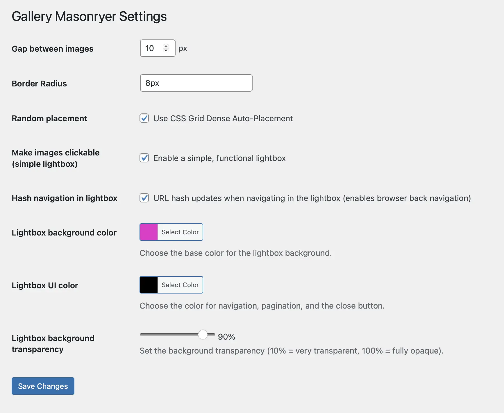

# jado Gallery Masonryer Plugin for WordPress

Turns every WordPress Gallery into a Masonry Grid (pure CSS) after activating the plugin.

## Features

- **Border Radius**: Customize the border radius of all images
- **Gap Control**: Adjust spacing between images
- **CSS Grid Dense Auto-placement**: Enable advanced grid positioning
- **Lightbox Integration**: Activate lightbox on all gallery images using [Swiper.js](https://swiperjs.com)
- **Hash Navigation**: Enable URL-based navigation in lightbox (optional)
- **Color Customization**: Configure overlay colors when lightbox is activated
- **UI Color Settings**: Customize lightbox navigation and button colors
- **Background Opacity**: Adjust lightbox background transparency

## Installation

1. Upload the plugin files to `/wp-content/plugins/gallery-masonryer/`
2. Activate the plugin through the 'Plugins' screen in WordPress
3. Go to Settings → Gallery Masonryer to configure options

## Requirements

- WordPress 5.0 or higher
- PHP 7.4 or higher

## Demo

Visit our demo website: [https://albert.ag](https://albert.ag)

## License

This plugin uses Swiper.js (MIT License) – Copyright © Vladimir Kharlampidi
